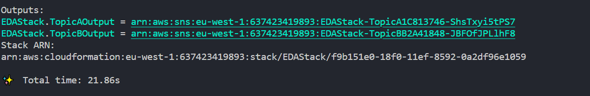

# ds-eda-exam

## Instructions

1. Clone this repository:
    ```sh
    git clone  https://github.com/diarmuidoconnor/ds-eda-exam.git 
    ```

2. Navigate to the project directory:
    ```sh
    cd ds-eda-exam
    ```

3. Install the necessary dependencies:
    ```sh
    npm install
    ```

4. Run the schema setup script:
    ```sh
    npm run schema
    ```

5. Study this project's code and thoroughly review the code in your submission for assignment 2.


6. picture of result 




